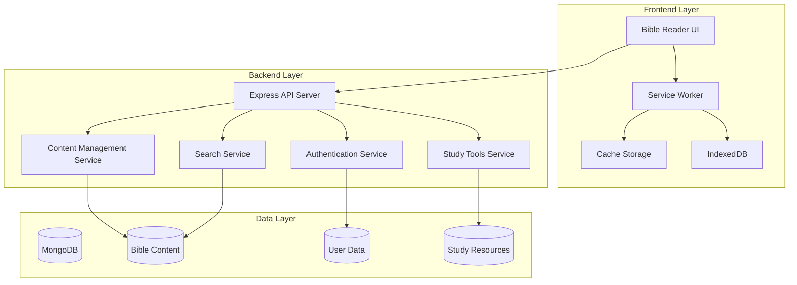

# Design Document

## Overview

This design document outlines the architecture and implementation approach for enhancing the Green Bible App with comprehensive Bible content, advanced search capabilities, and rich user experience features. The solution will transform the current basic Bible reader into a full-featured study application supporting multiple languages, offline capabilities, and advanced study tools.

The design follows a modular architecture with clear separation between content management, search functionality, study tools, and user experience components. The system will support progressive loading, offline-first design, and scalable data management to handle complete Bible texts across multiple versions and languages.

## Architecture

### High-Level Architecture



### Component Architecture

The system is organized into five main components:

1. **Content Management Layer**: Handles Bible text loading, validation, and serving
2. **Search and Discovery Layer**: Provides full-text search and content discovery
3. **Study Tools Layer**: Manages cross-references, commentaries, and study resources
4. **User Experience Layer**: Handles personalization, bookmarks, notes, and reading plans
5. **Offline and Performance Layer**: Manages caching, synchronization, and offline capabilities

## Components and Interfaces

### Content Management Service

**Purpose**: Manages complete Bible content across multiple versions and languages.

**Key Responsibilities**:
- Load and validate complete Bible texts (66 books, all chapters and verses)
- Support multiple Bible versions (KJV, NIV, ESV, NLT, NKJV, Ethiopian, Hebrew)
- Provide verse reference validation and normalization
- Handle progressive content loading for performance

**Interface**:
```typescript
interface ContentManager {
  // Core content retrieval
  getVerse(reference: VerseReference, version: BibleVersion): Promise<Verse>
  getChapter(book: string, chapter: number, version: BibleVersion): Promise<Chapter>
  getBook(book: string, version: BibleVersion): Promise<Book>
  
  // Content validation and utilities
  validateReference(reference: string): VerseReference | null
  getSupportedVersions(): BibleVersion[]
  getBookList(testament?: 'OT' | 'NT'): BookInfo[]
  
  // Progressive loading
  preloadContent(references: VerseReference[], version: BibleVersion): Promise<void>
  getCachedContent(reference: VerseReference): Verse | null
}

interface Verse {
  reference: VerseReference
  text: string
  version: BibleVersion
  language: string
  metadata?: VerseMetadata
}

interface VerseReference {
  book: string
  chapter: number
  verse: number
  endVerse?: number // for verse ranges
}
```

### Search Engine Service

**Purpose**: Provides comprehensive search capabilities across all Bible content.

**Key Responsibilities**:
- Full-text search across all loaded Bible versions
- Advanced filtering by book, testament, version
- Search result highlighting and ranking
- Auto-completion and search suggestions

**Interface**:
```typescript
interface SearchEngine {
  // Core search functionality
  searchText(query: string, options: SearchOptions): Promise<SearchResult[]>
  searchByReference(reference: string): Promise<Verse[]>
  
  // Advanced search features
  getSearchSuggestions(partialQuery: string): Promise<string[]>
  searchWithFilters(query: string, filters: SearchFilters): Promise<SearchResult[]>
  
  // Search optimization
  indexContent(content: BibleContent): Promise<void>
  clearSearchIndex(): Promise<void>
}

interface SearchOptions {
  versions?: BibleVersion[]
  books?: string[]
  testament?: 'OT' | 'NT'
  exactPhrase?: boolean
  maxResults?: number
}

interface SearchResult {
  verse: Verse
  relevanceScore: number
  highlightedText: string
  context: string
}
```

### Study Tools Service

**Purpose**: Provides cross-references, commentaries, and advanced study resources.

**Key Responsibilities**:
- Generate and serve cross-reference data
- Provide commentary and interpretation content
- Support word studies and original language resources
- Handle parallel passage comparison

**Interface**:
```typescript
interface StudyTools {
  // Cross-references
  getCrossReferences(reference: VerseReference): Promise<CrossReference[]>
  getParallelPassages(reference: VerseReference): Promise<ParallelPassage[]>
  
  // Commentary and study notes
  getCommentary(reference: VerseReference): Promise<Commentary[]>
  getWordStudy(word: string, language: 'hebrew' | 'greek'): Promise<WordStudy>
  
  // Topical studies
  getTopicalReferences(topic: string): Promise<TopicalStudy>
  getThematicStudies(): Promise<ThematicStudy[]>
}

interface CrossReference {
  sourceReference: VerseReference
  targetReference: VerseReference
  relationship: 'parallel' | 'quotation' | 'allusion' | 'theme'
  strength: number // 1-10 relevance score
}

interface Commentary {
  reference: VerseReference
  author: string
  text: string
  type: 'verse' | 'passage' | 'chapter'
  source: string
}
```

### User Experience Service

**Purpose**: Manages user personalization, bookmarks, notes, and reading plans.

**Key Responsibilities**:
- Handle user bookmarks and personal notes
- Manage reading plans and progress tracking
- Support highlighting and annotation features
- Provide sharing and export capabilities

**Interface**:
```typescript
interface UserExperience {
  // Bookmarks and notes
  addBookmark(reference: VerseReference, note?: string, category?: string): Promise<Bookmark>
  getBookmarks(userId: string, category?: string): Promise<Bookmark[]>
  addNote(reference: VerseReference, content: string): Promise<Note>
  
  // Highlighting and annotations
  addHighlight(reference: VerseReference, color: string, text: string): Promise<Highlight>
  getHighlights(userId: string): Promise<Highlight[]>
  
  // Reading plans
  getReadingPlans(): Promise<ReadingPlan[]>
  startReadingPlan(planId: string, userId: string): Promise<UserReadingPlan>
  markReadingComplete(planId: string, day: number, userId: string): Promise<void>
  getReadingProgress(planId: string, userId: string): Promise<ReadingProgress>
  
  // Sharing and export
  shareVerse(reference: VerseReference, platform: string): Promise<ShareResult>
  exportNotes(userId: string, format: 'json' | 'pdf' | 'txt'): Promise<ExportResult>
}

interface Bookmark {
  id: string
  reference: VerseReference
  note?: string
  category?: string
  createdAt: Date
  userId: string
}

interface ReadingPlan {
  id: string
  name: string
  description: string
  duration: number // days
  dailyReadings: DailyReading[]
}
```

### Offline Storage Service

**Purpose**: Manages offline capabilities, caching, and data synchronization.

**Key Responsibilities**:
- Cache Bible content in IndexedDB for offline access
- Synchronize user data between local and server storage
- Handle conflict resolution for offline changes
- Provide progressive loading and background sync

**Interface**:
```typescript
interface OfflineStorage {
  // Content caching
  cacheContent(content: BibleContent): Promise<void>
  getCachedContent(reference: VerseReference): Promise<Verse | null>
  preloadForOffline(references: VerseReference[]): Promise<void>
  
  // User data sync
  syncUserData(userId: string): Promise<SyncResult>
  handleOfflineChanges(changes: OfflineChange[]): Promise<void>
  
  // Storage management
  getStorageUsage(): Promise<StorageInfo>
  clearCache(olderThan?: Date): Promise<void>
  
  // Offline status
  isOffline(): boolean
  onOfflineStatusChange(callback: (offline: boolean) => void): void
}

interface SyncResult {
  success: boolean
  conflicts: DataConflict[]
  syncedItems: number
  errors: SyncError[]
}
```

## Data Models

### Bible Content Structure

The Bible content will be organized in a hierarchical structure optimized for both storage efficiency and query performance:

```typescript
interface BibleVersion {
  id: string
  name: string
  abbreviation: string
  language: string
  year: number
  copyright?: string
  features: VersionFeature[]
}

interface Book {
  name: string
  abbreviation: string
  testament: 'OT' | 'NT'
  chapters: Chapter[]
  metadata: BookMetadata
}

interface Chapter {
  number: number
  verses: Verse[]
  title?: string
}

interface Verse {
  number: number
  text: string
  footnotes?: Footnote[]
  crossReferences?: string[]
}
```

### User Data Structure

User-specific data will be stored separately to enable efficient synchronization and privacy:

```typescript
interface UserProfile {
  id: string
  email: string
  preferences: UserPreferences
  readingHistory: ReadingHistoryEntry[]
  createdAt: Date
  lastSyncAt: Date
}

interface UserPreferences {
  defaultVersion: string
  fontSize: number
  theme: 'light' | 'dark' | 'sepia'
  language: string
  autoSync: boolean
  offlineMode: boolean
}

interface Note {
  id: string
  reference: VerseReference
  content: string
  isPrivate: boolean
  tags: string[]
  createdAt: Date
  updatedAt: Date
}
```

## Correctness Properties

*A property is a characteristic or behavior that should hold true across all valid executions of a system-essentially, a formal statement about what the system should do. Properties serve as the bridge between human-readable specifications and machine-verifiable correctness guarantees.*

Based on the prework analysis, here are the key correctness properties that must be validated through property-based testing:

### Property 1: Complete Bible Content Loading
*For any* supported Bible version and any valid book from the 66-book canon, the Content_Manager should successfully load and return the complete book content
**Validates: Requirements 1.1, 1.2**

### Property 2: Verse Reference Validation
*For any* string input, the Content_Manager should correctly identify whether it represents a valid verse reference according to the complete biblical canon
**Validates: Requirements 1.6**

### Property 3: Search Completeness
*For any* search query and selected Bible versions, the Search_Engine should return all verses containing the search terms from those versions
**Validates: Requirements 2.1, 2.2**

### Property 4: Search Result Highlighting
*For any* search query that returns results, all matching terms should be highlighted in the returned search results
**Validates: Requirements 2.3**

### Property 5: Cross-Reference Navigation
*For any* cross-reference link that is clicked, the Bible_Reader should navigate to the correct target passage
**Validates: Requirements 3.3**

### Property 6: Bookmark Persistence
*For any* verse that is bookmarked by a user, the bookmark should be retrievable from the user's personal collection in subsequent sessions
**Validates: Requirements 4.1**

### Property 7: Highlight Persistence
*For any* text that is highlighted by a user, the highlighting should persist across application sessions and restarts
**Validates: Requirements 4.6**

### Property 8: Reading Plan Progress Tracking
*For any* reading plan and any completed reading assignment, the progress should be accurately updated and reflected in the overall completion percentage
**Validates: Requirements 5.2, 5.4, 5.6**

### Property 9: Language Display Consistency
*For any* Bible version in Ethiopian or Hebrew, the text should display using the appropriate fonts and text direction (right-to-left for Hebrew)
**Validates: Requirements 6.1, 6.2**

### Property 10: Offline Content Access
*For any* Bible content that was previously loaded while online, it should remain accessible when the application is offline
**Validates: Requirements 7.2**

### Property 11: Performance Requirements
*For any* cached Bible content, loading and displaying verses should complete within 200ms
**Validates: Requirements 7.4**

### Property 12: Data Synchronization Integrity
*For any* user data synchronization operation, conflicts between local and server data should be resolved without data loss
**Validates: Requirements 7.5**

## Error Handling

The system implements comprehensive error handling across all components:

### Content Loading Errors
- **Missing Content**: When Bible content is unavailable, display user-friendly messages with suggestions for alternative versions
- **Corrupted Data**: Validate content integrity and provide fallback to cached or alternative sources
- **Network Failures**: Gracefully degrade to offline mode with clear status indicators

### Search Errors
- **No Results**: Provide search suggestions and alternative query recommendations
- **Invalid Queries**: Guide users with query syntax help and auto-correction
- **Performance Issues**: Implement query timeouts and progressive result loading

### User Data Errors
- **Sync Conflicts**: Present conflict resolution options to users with clear explanations
- **Storage Limits**: Warn users about storage constraints and provide cleanup options
- **Authentication Issues**: Handle token expiration and provide seamless re-authentication

### Offline Handling
- **Connection Loss**: Automatically switch to offline mode with visual indicators
- **Data Staleness**: Clearly indicate when content may be outdated
- **Sync Failures**: Queue operations for retry when connection is restored

## Testing Strategy

The testing approach combines unit testing for specific functionality with property-based testing for universal correctness guarantees:

### Unit Testing Focus
- **Specific Examples**: Test known verse references, search queries, and user interactions
- **Edge Cases**: Handle boundary conditions like first/last verses, empty searches, and invalid inputs
- **Integration Points**: Verify component interactions and API contracts
- **Error Conditions**: Test all error scenarios and recovery mechanisms

### Property-Based Testing Configuration
- **Test Framework**: Use fast-check for JavaScript/TypeScript property-based testing
- **Minimum Iterations**: Configure each property test to run 100+ iterations for thorough coverage
- **Test Data Generation**: Create smart generators for Bible references, search queries, and user data
- **Property Validation**: Each property test must reference its corresponding design document property

### Testing Implementation Requirements
- **Dual Coverage**: Both unit and property tests are required for comprehensive validation
- **Performance Testing**: Validate 200ms loading requirements and offline performance
- **Accessibility Testing**: Verify keyboard navigation, screen reader compatibility, and font rendering
- **Cross-Platform Testing**: Test across different browsers, devices, and operating systems

### Test Organization
Each correctness property will be implemented as a separate property-based test with the following tag format:
**Feature: comprehensive-bible-enhancement, Property {number}: {property_text}**

Example test structure:
```javascript
// Feature: comprehensive-bible-enhancement, Property 1: Complete Bible Content Loading
test('Complete Bible Content Loading', () => {
  fc.assert(fc.property(
    fc.record({
      version: fc.constantFrom('kjv', 'niv', 'esv', 'nlt', 'nkjv'),
      book: fc.constantFrom(...BIBLE_BOOKS)
    }),
    async ({ version, book }) => {
      const content = await contentManager.getBook(book, version);
      expect(content).toBeDefined();
      expect(content.chapters.length).toBeGreaterThan(0);
      expect(content.chapters.every(ch => ch.verses.length > 0)).toBe(true);
    }
  ));
});
```

<function_calls>
<invoke name="prework">
<parameter name="featureName">comprehensive-bible-enhancement